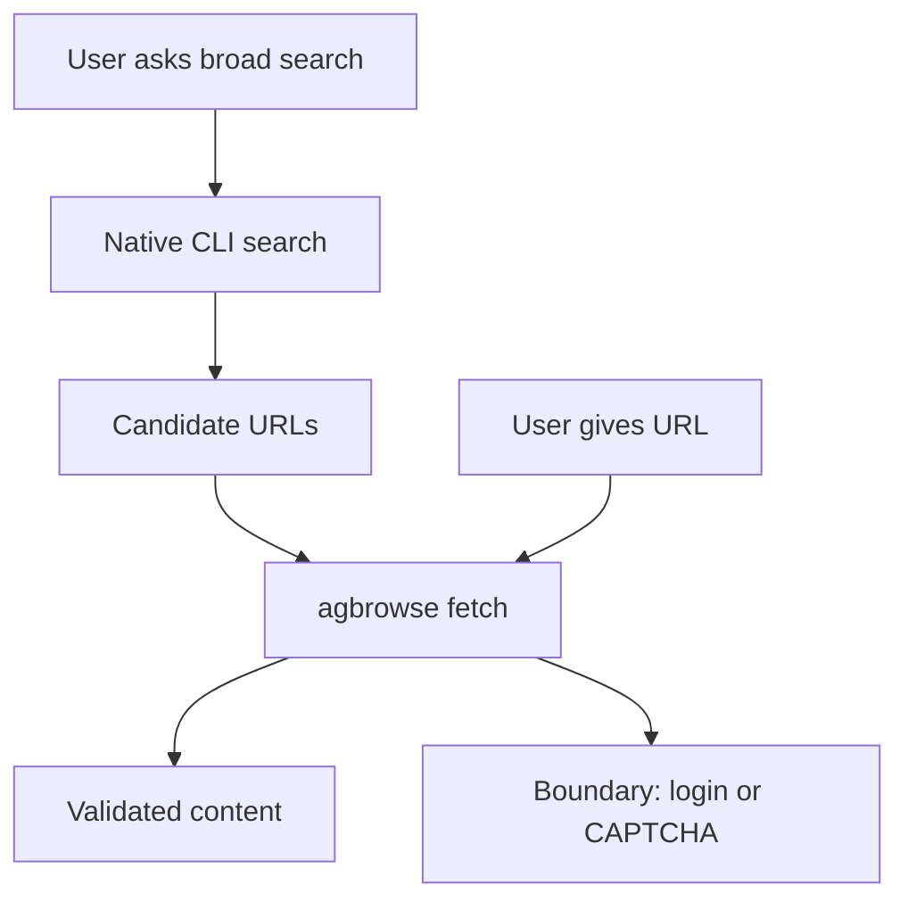
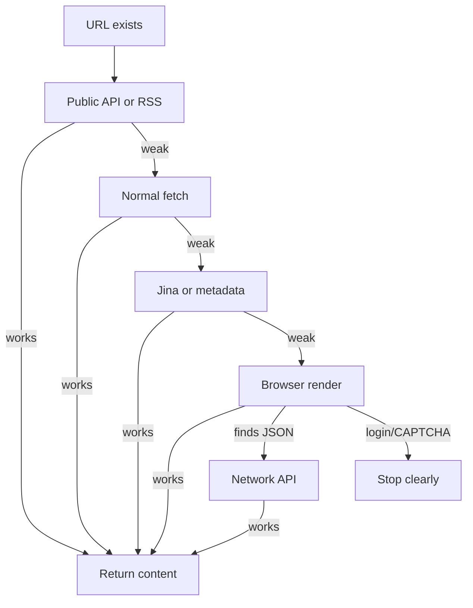
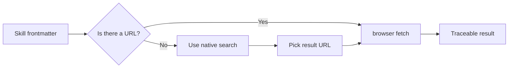

# ELI5 Visual Explanation

## agbrowse Mirror Note

In agbrowse, the command in the pictures is:

```bash
agbrowse fetch <url>
```

If cli-jaw mirrors the feature later, `cli-jaw browser fetch` should return the
same kind of result while keeping the same "search first, fetch URL second"
boundary.

## Tiny Explanation

Imagine the internet is a library.

The normal search tool finds book addresses.

`agbrowse fetch` is the helper that goes to one book address and tries to read
the book safely.

If the front door is locked, it checks whether the library has another official
desk:

- public API desk;
- RSS shelf;
- JSON drawer;
- clean reader copy;
- metadata card;
- browser reading room.

If the book needs a private membership card, CAPTCHA, or payment, the helper
stops and says so.

## Search Versus Browser Fetch



Search finds candidate doors. Browser fetch checks one door and tries safe ways
to read what is behind it.

## The Ladder



The important part is not trying many things randomly. The important part is
checking each result and keeping a trace.

## Skill Routing Picture



The word "search" alone should not trigger browser fetch. "Search result URL" can
trigger browser fetch.

## Playground Example

User:

```text
이 검색 결과 링크 본문 뽑아줘
```

Agent:

```text
URL exists → use agbrowse fetch
```

User:

```text
요즘 AI 뉴스 검색해줘
```

Agent:

```text
No URL yet → native search first → then browser fetch selected links
```

## One Sentence

`agbrowse fetch` is not the search engine. It is the careful reader that opens a
chosen URL, checks whether the content is real, and tries safe alternate doors
when the first door is blocked.
