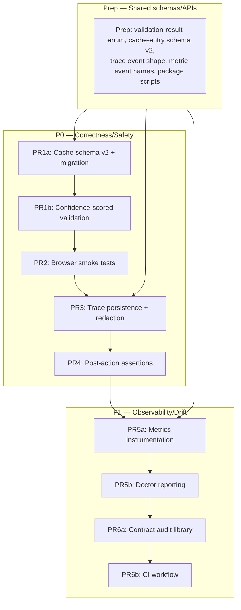

# Phase 8.1 — Self-healing hardening (GPT-Pro-validated, v2)

## Part 1: Summary

After GPT Pro review, the original plan was **not implementation-ready**. This revised plan adds a **Prep PR for shared schemas**, splits PR1 into schema migration + validation scoring, fixes critical blockers (nameHash validation, ambiguous selector rejection, atomic trace writes, real post-action assertions, wired metrics), and removes the throwing-stub PR7.

**Revised Mermaid diagram:**



**Part 2 file:** `devlog/_plan/legacy_mvp_phase_plans/08_1_detailed.md` (this file, continued below)

---

## Part 2: Diff-level plan (revised)

### Prep PR: Shared schemas, APIs, and tooling

**Scope:** Before any hardening PR, define shared types, enums, schemas, and package scripts so subsequent PRs compile and integrate cleanly.

**Files:**
- MODIFY `web-ai/types.mjs` — add `ValidationResult`, `CacheEntryV2`, `TraceEvent`, `MetricEvent` types
- MODIFY `package.json` — add `test:integration`, `test:smoke`, `test:contract-drift` scripts
- MODIFY `web-ai/errors.mjs` — add `VALIDATION_REJECTED` error code
- NEW `web-ai/constants.mjs` — shared enums and thresholds

#### NEW `web-ai/constants.mjs`

```js
export const CACHE_SCHEMA_VERSION = 2;
export const VALIDATION_THRESHOLD = 0.6;
export const MAX_TRACE_STEPS = 200;
export const MAX_TRACE_BYTES = 1024 * 1024; // 1MB
export const VALIDATION_REASONS = Object.freeze({
    NOT_FOUND: 'not-found',
    AMBIGUOUS_SELECTOR: 'ambiguous-selector',
    NOT_VISIBLE: 'not-visible',
    NOT_ENABLED: 'not-enabled',
    NOT_EDITABLE: 'not-editable',
    LOW_CONFIDENCE: 'low-confidence',
    STALE_ROLE_NAME: 'stale-role-name',
    SCHEMA_VERSION_MISMATCH: 'schema-version-mismatch',
    CONTRACT_VERSION_MISMATCH: 'contract-version-mismatch',
    FRAME_PATH_MISMATCH: 'frame-path-mismatch',
    BROWSER_CONFIG_MISMATCH: 'browser-config-mismatch',
    INSUFFICIENT_CONTRACT: 'insufficient-semantic-contract',
    REF_STALE: 'ref-stale',
    REF_INVALID: 'ref-invalid',
    REF_NO_SELECTOR: 'ref-no-selector',
    MISSING_SELECTOR: 'missing-selector',
});
export const RESOLUTION_SOURCES = Object.freeze({
    CACHE: 'cache',
    SNAPSHOT_SEMANTIC: 'snapshot-semantic',
    CSS_FALLBACK: 'css-fallback',
    OBSERVE_RANKED: 'observe-ranked',
});
```

#### MODIFY `package.json`

**Modify existing scripts (test:integration already exists):**
```json
{
  "test:smoke": "vitest run test/integration/self-heal-smoke.test.mjs",
  "test:contract-drift": "vitest run test/unit/web-ai-contract-audit.test.mjs"
}
```
*(Note: `test:integration` already exists at `"vitest run test/integration"`; do NOT modify.)*

---

### 8.1-PR1a: Cache schema v2 + migration

**Scope:** Bump cache schema, add new fields, reject/migrate old entries.

**Files:**
- MODIFY `web-ai/action-cache.mjs`
- NEW `test/unit/web-ai-cache-schema.test.mjs`

#### MODIFY `web-ai/action-cache.mjs`

**Full replacement of schema constants and load function:**

```js
import { existsSync, readFileSync, writeFileSync, mkdirSync, renameSync } from 'node:fs';
import { join } from 'node:path';
import { homedir } from 'node:os';
import { createHash } from 'node:crypto';
import { CACHE_SCHEMA_VERSION } from './constants.mjs';

const DEFAULT_HOME = process.env.BROWSER_AGENT_HOME || join(homedir(), '.browser-agent');
const CACHE_FILE = 'action-cache.json';
const STALE_MS = 30 * 86_400_000;

export function cacheKey({ provider, urlHost, intent, actionKind, domHashPrefix, axHashPrefix }) {
    return [
        'v2',
        provider || '*',
        urlHost || '*',
        intent || '*',
        actionKind || '*',
        domHashPrefix || '*',
        axHashPrefix || '*',
    ].join('|');
}

export function loadActionCache(homeDir = DEFAULT_HOME) {
    const path = join(homeDir, CACHE_FILE);
    if (!existsSync(path)) return createEmptyCache();
    try {
        const raw = JSON.parse(readFileSync(path, 'utf8'));
        // Schema migration: reject old schema entirely
        if (raw.schemaVersion !== CACHE_SCHEMA_VERSION) {
            return createEmptyCache();
        }
        const now = Date.now();
        const entries = {};
        for (const [key, entry] of Object.entries(raw.entries || {})) {
            const lastValidated = entry.stats?.lastValidatedAt ? new Date(entry.stats.lastValidatedAt).getTime() : 0;
            if (now - lastValidated < STALE_MS) {
                entries[key] = entry;
            }
        }
        return { schemaVersion: CACHE_SCHEMA_VERSION, entries };
    } catch {
        return createEmptyCache();
    }
}

function createEmptyCache() {
    return { schemaVersion: CACHE_SCHEMA_VERSION, entries: {} };
}

export function saveActionCache(cache, homeDir = DEFAULT_HOME) {
    mkdirSync(homeDir, { recursive: true });
    const path = join(homeDir, CACHE_FILE);
    const tmpPath = path + `.tmp.${process.pid}.${Date.now()}`;
    writeFileSync(tmpPath, JSON.stringify(cache, null, 2));
    renameSync(tmpPath, path);
}
```

**Update `updateCacheEntry` to store V2 fields:**

```js
export function updateCacheEntry(cache, ctx, resolvedTarget, fingerprint, {
    contractVersion = '1.0',
    framePath = null,
    browserConfigHash = null,
} = {}) {
    if (!cache || !resolvedTarget?.selector) return;
    const { provider, intent, actionKind, urlHost } = ctx;
    const key = cacheKey({
        provider,
        urlHost,
        intent,
        actionKind,
        domHashPrefix: fingerprint?.domHashPrefix || null,
        axHashPrefix: fingerprint?.axHashPrefix || null,
    });
    const existing = cache.entries[key];
    cache.entries[key] = {
        schemaVersion: CACHE_SCHEMA_VERSION,
        provider,
        intent,
        actionKind,
        urlHost: urlHost || null,
        pageFingerprint: fingerprint || {},
        contractVersion,
        framePath,
        browserConfigHash,
        target: {
            selector: resolvedTarget.selector,
            role: resolvedTarget.role || null,
            nameHash: resolvedTarget.name ? hashField(resolvedTarget.name) : null,
            nameChars: resolvedTarget.name ? String(resolvedTarget.name).length : 0,
            signatureHash: signatureHash({ provider, intent, actionKind, role: resolvedTarget.role, selector: resolvedTarget.selector }),
        },
        stats: {
            hitCount: (existing?.stats?.hitCount || 0) + 1,
            lastValidatedAt: new Date().toISOString(),
        },
    };
}

export function getCachedTarget(cache, { provider, intent, actionKind, urlHost, fingerprint }) {
    if (!cache?.entries) return null;
    const key = cacheKey({
        provider,
        urlHost,
        intent,
        actionKind,
        domHashPrefix: fingerprint?.domHashPrefix || null,
        axHashPrefix: fingerprint?.axHashPrefix || null,
    });
    const entry = cache.entries[key];
    if (!entry) return null;
    // Merge entry metadata into target for validation
    return {
        target: {
            ...entry.target,
            schemaVersion: entry.schemaVersion,
            contractVersion: entry.contractVersion,
            framePath: entry.framePath,
            browserConfigHash: entry.browserConfigHash,
        },
        key,
        entry,
    };
}
```

---

### 8.1-PR1b: Confidence-scored validation

**Scope:** Replace boolean validation with confidence scoring. Reject ambiguous selectors. Use nameHash for cached entries. Enforce contractVersion, framePath, browserConfigHash.

**Files:**
- MODIFY `web-ai/self-heal.mjs`
- NEW `test/unit/web-ai-self-heal-validation.test.mjs`

#### MODIFY `web-ai/self-heal.mjs`

**Add imports at top of file:**
```js
import { CACHE_SCHEMA_VERSION, VALIDATION_REASONS, VALIDATION_THRESHOLD } from './constants.mjs';
import { createHash } from 'node:crypto';

// Preserve backward-compatible alias for existing consumers
export { RESOLUTION_SOURCES as ResolutionSource } from './constants.mjs';
```

**Modify `resolveActionTarget` to accept selector override:**
```js
export async function resolveActionTarget(page, ctx) {
    const {
        provider,
        intent,
        actionKind = 'click',
        snapshot = null,
        registry = null,
        cache = null,
        fingerprint = null,
        feature: featureOverride = null,
        semanticTargetOverride = null,
        selectors: selectorsOverride = null, // NEW: allow test/local override
    } = ctx;

    const feature = resolveIntentFeature(intent, featureOverride);
    const allTargets = semanticTargetsForVendor(provider);
    const semanticTarget = semanticTargetOverride || (feature ? allTargets[feature] : null);
    const selectors = selectorsOverride || semanticTarget?.cssFallbacks || []; // MODIFIED
```

**Replace `validateResolvedTarget` (lines 159-222):**

```js
export async function validateResolvedTarget(page, target, {
    semanticTarget = null,
    actionKind = 'click',
    registry = null,
    contractVersion = null,
    framePath = null,
    browserConfigHash = null,
} = {}) {
    // 1. Schema/contract eligibility
    if (target?.schemaVersion && target.schemaVersion !== CACHE_SCHEMA_VERSION) {
        return { ok: false, reason: VALIDATION_REASONS.SCHEMA_VERSION_MISMATCH };
    }
    if (target?.contractVersion && contractVersion && target.contractVersion !== contractVersion) {
        return { ok: false, reason: VALIDATION_REASONS.CONTRACT_VERSION_MISMATCH };
    }
    if (target?.framePath && framePath && target.framePath !== framePath) {
        return { ok: false, reason: VALIDATION_REASONS.FRAME_PATH_MISMATCH };
    }
    if (target?.browserConfigHash && browserConfigHash && target.browserConfigHash !== browserConfigHash) {
        return { ok: false, reason: VALIDATION_REASONS.BROWSER_CONFIG_MISMATCH };
    }

    let selector = target?.selector;

    // 2. Ref resolution
    if (target?.ref && registry) {
        if (isRegistryStale(registry)) {
            return { ok: false, reason: VALIDATION_REASONS.REF_STALE };
        }
        try {
            const entry = await resolveRef(page, registry, target.ref, { allowStale: false });
            if (entry.selector) selector = entry.selector;
        } catch {
            return { ok: false, reason: VALIDATION_REASONS.REF_INVALID };
        }
    }

    // 3. Role+name locator fallback (no selector)
    if (!selector) {
        if (target?.ref && target.role && target.name) {
            const roleLocator = page.getByRole(target.role, { name: new RegExp(escapeForRegExp(target.name), 'i') });
            const roleCount = await roleLocator.count().catch(() => 0);
            if (roleCount === 0) return { ok: false, reason: VALIDATION_REASONS.NOT_FOUND };
            if (roleCount > 1) return { ok: false, reason: VALIDATION_REASONS.AMBIGUOUS_SELECTOR, count: roleCount };
            const roleEl = roleLocator.first();
            const roleVisible = await roleEl.isVisible().catch(() => false);
            if (!roleVisible) return { ok: false, reason: VALIDATION_REASONS.NOT_VISIBLE };
            const roleEnabled = await roleEl.isEnabled().catch(() => false);
            if (!roleEnabled) return { ok: false, reason: VALIDATION_REASONS.NOT_ENABLED };
            if (actionKind === 'fill') {
                const editable = await roleEl.isEditable().catch(() => false);
                if (!editable) return { ok: false, reason: VALIDATION_REASONS.NOT_EDITABLE };
            }
            return { ok: true, resolvedVia: 'role-locator', confidence: 1.0 };
        }
        if (target?.ref) return { ok: false, reason: VALIDATION_REASONS.REF_NO_SELECTOR };
        return { ok: false, reason: VALIDATION_REASONS.MISSING_SELECTOR };
    }

    // 4. Selector-based validation
    const locator = page.locator(selector);
    const count = await locator.count().catch(() => 0);
    if (count === 0) return { ok: false, reason: VALIDATION_REASONS.NOT_FOUND };
    if (count > 1) return { ok: false, reason: VALIDATION_REASONS.AMBIGUOUS_SELECTOR, count };

    const el = locator.first();
    const visible = await el.isVisible().catch(() => false);
    if (!visible) return { ok: false, reason: VALIDATION_REASONS.NOT_VISIBLE };

    const enabled = await el.isEnabled().catch(() => false);
    if (!enabled) return { ok: false, reason: VALIDATION_REASONS.NOT_ENABLED };

    if (actionKind === 'fill') {
        const editable = await el.isEditable().catch(() => false);
        if (!editable) return { ok: false, reason: VALIDATION_REASONS.NOT_EDITABLE };
    }

    // 5. Confidence-scored semantic validation
    const validation = await runValidationContract(page, el, {
        target,
        semanticTarget,
        actionKind,
    });
    if (!validation.ok) {
        return { ok: false, reason: validation.reason, confidence: validation.confidence };
    }

    return { ok: true, confidence: validation.confidence };
}
```

**Replace `runValidationContract` (formerly `checkSemanticMatch`):**

```js
async function runValidationContract(page, locator, { target, semanticTarget, actionKind }) {
    try {
        const info = await locator.evaluate((node) => {
            const explicitRole = node.getAttribute('role');
            const tag = node.tagName.toLowerCase();
            const isEditable = node.isContentEditable || node.contentEditable === 'true';
            const implicitRole = explicitRole
                || (tag === 'textarea' ? 'textbox'
                    : (tag === 'input' && (!node.type || node.type === 'text') ? 'textbox'
                        : (isEditable ? 'textbox'
                            : (tag === 'button' ? 'button'
                                : (tag === 'a' && node.href ? 'link' : tag)))));
            const label = node.getAttribute('aria-label') || '';
            const labelledById = node.getAttribute('aria-labelledby') || '';
            let labelText = label;
            if (!labelText && labelledById) {
                const ref = node.ownerDocument?.getElementById(labelledById);
                labelText = ref?.textContent?.trim()?.slice(0, 100) || '';
            }
            if (!labelText) labelText = node.textContent?.trim()?.slice(0, 100) || '';
            return { role: implicitRole, label: labelText, tagName: tag, isEditable };
        }).catch(() => null);

        if (!info) return { ok: false, reason: 'eval-failed', confidence: 0 };

        let score = 0;
        let maxScore = 0;

        // Role check (weight: 3)
        maxScore += 3;
        if (target.role) {
            if (target.role === info.role) score += 3;
            else if (semanticTarget?.roles?.includes(info.role)) score += 2;
        } else if (semanticTarget?.roles?.includes(info.role)) {
            score += 3;
        }

        // Name check (weight: 3) — use nameHash for privacy
        maxScore += 3;
        if (target.nameHash) {
            const currentNameHash = info.label ? hashField(info.label) : null;
            if (currentNameHash === target.nameHash) score += 3;
        } else if (target.name) {
            const namePattern = new RegExp(escapeForRegExp(target.name), 'i');
            if (namePattern.test(info.label)) score += 3;
        } else if (semanticTarget?.names?.some(p => patternMatches(p, info.label))) {
            score += 3;
        } else if (!target.nameHash && !target.name && !semanticTarget?.names?.length) {
            return { ok: false, reason: VALIDATION_REASONS.INSUFFICIENT_CONTRACT, confidence: 0 };
        }

        // Exclude names (weight: 2, penalty)
        maxScore += 2;
        if (semanticTarget?.excludeNames?.some(p => patternMatches(p, info.label))) {
            score -= 2;
        } else {
            score += 2;
        }

        // Action compatibility (weight: 2)
        maxScore += 2;
        if (actionKind === 'fill') {
            if (info.isEditable || info.tagName === 'textarea' || info.tagName === 'input') {
                score += 2;
            }
        } else if (actionKind === 'click') {
            if (info.tagName === 'button' || info.tagName === 'a' || info.role === 'button') {
                score += 2;
            }
        }

        const confidence = maxScore > 0 ? score / maxScore : 1;

        if (confidence < VALIDATION_THRESHOLD) {
            return { ok: false, reason: VALIDATION_REASONS.LOW_CONFIDENCE, confidence };
        }

        return { ok: true, confidence };
    } catch {
        return { ok: false, reason: 'contract-error', confidence: 0 };
    }
}
```

**Add hashField import (from action-cache.mjs or inline):**

```js
import { createHash } from 'node:crypto';

function hashField(value) {
    return `sha256:${createHash('sha256').update(String(value)).digest('hex').slice(0, 12)}`;
}
```

---

### 8.1-PR2: Browser smoke tests

**Scope:** Real Playwright integration tests with fixture pages including negative cases.

**Files:**
- NEW `test/integration/self-heal-smoke.test.mjs`
- NEW `test/integration/smoke-server.mjs`
- NEW `test/fixtures/provider-dom/chatgpt-composer-v1.html`
- NEW `test/fixtures/provider-dom/chatgpt-composer-v2.html`
- NEW `test/fixtures/provider-dom/chatgpt-composer-stale.html`
- NEW `test/fixtures/provider-dom/chatgpt-composer-duplicate.html`
- NEW `test/fixtures/provider-dom/chatgpt-composer-overlay.html`
- NEW `test/fixtures/provider-dom/chatgpt-composer-disabled.html`
- NEW `test/fixtures/provider-dom/gemini-composer-v1.html`

*(Fixture HTML files same as v1 plan but expanded with duplicate, overlay, disabled variants)*

#### NEW `test/integration/self-heal-smoke.test.mjs` (expanded)

```js
import { describe, expect, it, beforeAll, afterAll } from 'vitest';
import { chromium } from 'playwright-core';
import { resolveActionTarget, validateResolvedTarget } from '../../web-ai/self-heal.mjs';
import { createActionCacheHandle } from '../../web-ai/action-cache.mjs';
import { startSmokeServer, stopSmokeServer } from './smoke-server.mjs';

describe('self-heal browser smoke', () => {
    let server;
    let serverUrl;
    let browser;

    beforeAll(async () => {
        const result = await startSmokeServer();
        server = result.server;
        serverUrl = result.url;
        browser = await chromium.launch();
    });

    afterAll(async () => {
        await browser?.close();
        await stopSmokeServer(server);
    });

    it('resolves composer via CSS fallback on v1 fixture', async () => {
        const page = await browser.newPage();
        await page.goto(`${serverUrl}/chatgpt-composer-v1.html`);

        const result = await resolveActionTarget(page, {
            provider: 'chatgpt',
            intent: 'composer.fill',
            actionKind: 'fill',
            selectors: ['#prompt-textarea', '[data-testid="composer-textarea"]', 'div[contenteditable="true"]'],
        });

        expect(result.ok).toBe(true);
        expect(result.target.selector).toBe('#prompt-textarea');
        expect(result.target.resolution).toBe('css-fallback');
        await page.close();
    });

    it('rejects stale selector when element role changed', async () => {
        const page = await browser.newPage();
        await page.goto(`${serverUrl}/chatgpt-composer-stale.html`);

        const result = await validateResolvedTarget(page, {
            selector: '#prompt-textarea',
            role: 'textbox',
            nameHash: null, // would be hashField('Message ChatGPT') in real usage
        }, {
            semanticTarget: { roles: ['textbox'], names: [/message/i] },
            actionKind: 'fill',
        });

        expect(result.ok).toBe(false);
        expect(result.reason).toBe('low-confidence');
        await page.close();
    });

    it('rejects ambiguous selector (duplicate buttons)', async () => {
        const page = await browser.newPage();
        await page.goto(`${serverUrl}/chatgpt-composer-duplicate.html`);

        const result = await validateResolvedTarget(page, {
            selector: 'button[aria-label="Send message"]',
        }, { actionKind: 'click' });

        expect(result.ok).toBe(false);
        expect(result.reason).toBe('ambiguous-selector');
        expect(result.count).toBe(2);
        await page.close();
    });

    it('uses cached selector on v1, then heals on v2 after redesign', async () => {
        const cache = createActionCacheHandle();
        const urlHost = new URL(serverUrl).hostname;
        
        const page1 = await browser.newPage();
        await page1.goto(`${serverUrl}/chatgpt-composer-v1.html`);
        const result1 = await resolveActionTarget(page1, {
            provider: 'chatgpt',
            intent: 'composer.fill',
            actionKind: 'fill',
            cache,
            selectors: ['#prompt-textarea'],
        });
        expect(result1.ok).toBe(true);
        cache.update(
            { provider: 'chatgpt', intent: 'composer.fill', actionKind: 'fill', urlHost },
            result1.target,
            { domHashPrefix: 'mock', axHashPrefix: 'mock' }
        );

        const page2 = await browser.newPage();
        await page2.goto(`${serverUrl}/chatgpt-composer-v2.html`);
        const result2 = await resolveActionTarget(page2, {
            provider: 'chatgpt',
            intent: 'composer.fill',
            actionKind: 'fill',
            cache,
            selectors: ['#composer-textarea'],
            fingerprint: { domHashPrefix: 'mock', axHashPrefix: 'mock' },
        });
        expect(result2.ok).toBe(true);
        expect(result2.attempts.some(a => a.source === 'cache')).toBe(true);
        expect(result2.target.resolution).toBe('css-fallback');
        await page1.close();
        await page2.close();
    });
});
```

---

### 8.1-PR3: Trace persistence + redaction

**Scope:** Atomic session trace updates, recursive redaction, bounded retention.

**Files:**
- NEW `web-ai/trace-persistence.mjs`
- MODIFY `web-ai/session.mjs`
- NEW `test/unit/web-ai-trace-persistence.test.mjs`

#### NEW `web-ai/trace-persistence.mjs`

```js
import { writeFileSync, readFileSync, existsSync, renameSync } from 'node:fs';
import { join } from 'node:path';
import { MAX_TRACE_STEPS, MAX_TRACE_BYTES } from './constants.mjs';

const REDACTION_PATTERNS = [
    /sk-[a-zA-Z0-9]{20,}/g,
    /sk-proj-[a-zA-Z0-9_-]{20,}/g,
    /Bearer\s+[a-zA-Z0-9._-]+/gi,
    /[a-zA-Z0-9._%+-]+@[a-zA-Z0-9.-]+\.[a-zA-Z]{2,}/g,
    /\b\d{4}[\s-]?\d{4}[\s-]?\d{4}[\s-]?\d{4}\b/g,
];

export function redactSensitive(value) {
    if (typeof value === 'string') {
        let redacted = value;
        for (const pattern of REDACTION_PATTERNS) {
            redacted = redacted.replace(pattern, '[REDACTED]');
        }
        return redacted;
    }
    if (Array.isArray(value)) {
        return value.map(redactSensitive);
    }
    if (value && typeof value === 'object') {
        const result = {};
        for (const [k, v] of Object.entries(value)) {
            result[k] = redactSensitive(v);
        }
        return result;
    }
    return value;
}

import { getSession, updateSession } from './session.mjs';

export function appendTraceToSession(sessionId, steps) {
    if (!steps?.length) return;
    const redacted = redactSensitive(steps);
    
    const session = getSession(sessionId);
    if (!session) return;
    
    const trace = session.trace || [];
    trace.push(...redacted);
    
    // Bounded retention: steps and bytes
    while (trace.length > MAX_TRACE_STEPS) {
        trace.shift();
    }
    while (JSON.stringify(trace).length > MAX_TRACE_BYTES && trace.length > 0) {
        trace.shift();
    }
    
    updateSession(sessionId, { trace });
}
```

---

### 8.1-PR4: Post-action correctness assertions

**Scope:** Real post-action verification. Capture pre-state, execute, wait for post-state, emit false-heal event on mismatch.

**Files:**
- NEW `web-ai/post-action-assert.mjs`
- MODIFY `web-ai/browser-primitives.mjs`
- NEW `test/unit/web-ai-post-action-assert.test.mjs`
- NEW `test/integration/post-action-smoke.test.mjs`

#### NEW `web-ai/post-action-assert.mjs`

```js
// Export scrub helper so post-action-assert can reuse it
export function scrubTargetForTrace(target) {
    if (!target) return null;
    return {
        resolution: target.resolution || null,
        source: target.source || null,
        ref: target.ref || null,
        selector: target.selector || null,
        role: target.role || null,
    };
}

export async function assertPostAction(page, action, target, options = {}) {
    switch (action) {
        case 'fill': {
            const locator = page.locator(target.selector);
            const inputValue = typeof locator.inputValue === 'function'
                ? await locator.inputValue().catch(() => null)
                : null;
            const value = inputValue ?? await locator.evaluate(el => el.textContent || el.value || '').catch(() => '');
            const expected = options.expectedValue;
            if (expected && value !== expected) {
                return { ok: false, reason: 'value-mismatch', expected, actual: value };
            }
            return { ok: true };
        }
        case 'click': {
            if (options.expectElementVisible) {
                const visible = await page.locator(options.expectElementVisible).isVisible().catch(() => false);
                if (!visible) return { ok: false, reason: 'expected-element-not-visible' };
            }
            return { ok: true };
        }
        default:
            return { ok: true };
    }
}

export async function clickWithPostAssert(page, locator, resolvedTarget, traceCtx, options = {}) {
    const beforeUrl = page.url();
    
    try {
        await locator.click();
    } catch (err) {
        if (traceCtx) traceCtx.record({ action: 'click', target: scrubTargetForTrace(resolvedTarget), status: 'error', errorCode: err.name });
        throw err;
    }
    
    if (options.expectUrlChange) {
        try {
            await page.waitForURL(url => String(url) !== beforeUrl, { timeout: options.timeoutMs ?? 3000 });
        } catch {
            const afterUrl = page.url();
            if (afterUrl === beforeUrl) {
                const failure = { ok: false, reason: 'url-unchanged', beforeUrl, afterUrl };
                if (traceCtx) traceCtx.record({ action: 'click', target: scrubTargetForTrace(resolvedTarget), status: 'false-heal', error: failure });
                return failure;
            }
        }
    }
    
    const assertion = await assertPostAction(page, 'click', resolvedTarget, options);
    if (!assertion.ok) {
        if (traceCtx) traceCtx.record({ action: 'click', target: scrubTargetForTrace(resolvedTarget), status: 'false-heal', error: assertion });
        return assertion;
    }
    
    if (traceCtx) traceCtx.record({ action: 'click', target: scrubTargetForTrace(resolvedTarget), status: 'ok' });
    return { ok: true };
}

export async function fillWithPostAssert(page, locator, resolvedTarget, value, traceCtx, options = {}) {
    try {
        await locator.fill(value);
    } catch (fillErr) {
        // Try keyboard fallback for contenteditable
        const role = resolvedTarget.role || '';
        const isContentEditable = role === 'textbox' || resolvedTarget.contentEditable;
        if (isContentEditable) {
            try {
                await locator.click();
                const focused = await page.evaluate((sel) => {
                    const target = sel ? document.querySelector(sel) : null;
                    if (!target) return false;
                    return document.activeElement === target || target.contains(document.activeElement);
                }, resolvedTarget.selector || null).catch(() => false);
                if (!focused) {
                    if (traceCtx) traceCtx.record({ action: 'fill', target: scrubTargetForTrace(resolvedTarget), status: 'error', errorCode: 'focus-mismatch' });
                    throw fillErr;
                }
                const mod = process.platform === 'darwin' ? 'Meta' : 'Control';
                await page.keyboard.press(`${mod}+a`);
                await page.keyboard.insertText(value);
            } catch (kbErr) {
                if (traceCtx) traceCtx.record({ action: 'fill', target: scrubTargetForTrace(resolvedTarget), status: 'error', errorCode: kbErr.name });
                throw kbErr;
            }
        } else {
            if (traceCtx) traceCtx.record({ action: 'fill', target: scrubTargetForTrace(resolvedTarget), status: 'error', errorCode: fillErr.name });
            throw fillErr;
        }
    }
    
    const assertion = await assertPostAction(page, 'fill', resolvedTarget, { expectedValue: value });
    if (!assertion.ok) {
        if (traceCtx) traceCtx.record({ action: 'fill', target: scrubTargetForTrace(resolvedTarget), status: 'false-heal', error: assertion });
        return assertion;
    }
    
    if (traceCtx) traceCtx.record({ action: 'fill', target: scrubTargetForTrace(resolvedTarget), status: 'ok' });
    return { ok: true };
}
```

#### MODIFY `web-ai/browser-primitives.mjs`

**Replace existing `clickResolvedTarget` and `fillResolvedTarget` to delegate to post-action wrappers:**

```js
import { clickWithPostAssert, fillWithPostAssert } from './post-action-assert.mjs';

export async function clickResolvedTarget(page, locator, resolvedTarget, traceCtx) {
    return clickWithPostAssert(page, locator, resolvedTarget, traceCtx);
}

export async function fillResolvedTarget(page, locator, resolvedTarget, value, traceCtx) {
    return fillWithPostAssert(page, locator, resolvedTarget, value, traceCtx);
}
```

*(Remove old inline trace recording from browser-primitives.mjs; the wrappers in post-action-assert.mjs handle trace + post-action validation.)*

---

### 8.1-PR5a: Metrics instrumentation

**Scope:** Emit events from self-heal, browser-primitives. Persist to disk.

**Files:**
- NEW `web-ai/cache-metrics.mjs`
- MODIFY `web-ai/self-heal.mjs`
- MODIFY `web-ai/browser-primitives.mjs`

#### NEW `web-ai/cache-metrics.mjs`

```js
import { writeFileSync, readFileSync, existsSync, renameSync, mkdirSync } from 'node:fs';
import { join } from 'node:path';

const METRICS_FILE = 'web-ai-metrics.jsonl';

export function recordCacheEvent(homeDir, event) {
    mkdirSync(homeDir, { recursive: true });
    const path = join(homeDir, METRICS_FILE);
    const line = JSON.stringify({ ...event, ts: new Date().toISOString() }) + '\n';
    const tmpPath = path + `.tmp.${process.pid}.${Date.now()}`;
    let existing = '';
    if (existsSync(path)) {
        existing = readFileSync(path, 'utf8');
    }
    writeFileSync(tmpPath, existing + line);
    renameSync(tmpPath, path);
}

export function reportCacheMetricsFromEvents(homeDir) {
    const path = join(homeDir, METRICS_FILE);
    if (!existsSync(path)) return null;
    
    const lines = readFileSync(path, 'utf8').split('\n').filter(Boolean);
    const events = lines.map(l => JSON.parse(l)).filter(e => e.ts > new Date(Date.now() - 7 * 86400000).toISOString()); // last 7 days
    
    const report = {
        totalLookups: 0,
        cacheHitsValid: 0,
        cacheHitsRejected: 0,
        cacheMisses: 0,
        resolutionSources: {},
        falseHeals: 0,
        avgDurationMs: 0,
        p95DurationMs: 0,
    };
    
    const durations = [];
    for (const ev of events) {
        if (ev.type === 'lookup') report.totalLookups++;
        if (ev.type === 'cache-hit-valid') report.cacheHitsValid++;
        if (ev.type === 'cache-hit-rejected') report.cacheHitsRejected++;
        if (ev.type === 'cache-miss') report.cacheMisses++;
        if (ev.type === 'resolved') report.resolutionSources[ev.source] = (report.resolutionSources[ev.source] || 0) + 1;
        if (ev.type === 'false-heal') report.falseHeals++;
        if (ev.durationMs) durations.push(ev.durationMs);
    }
    
    if (durations.length) {
        report.avgDurationMs = durations.reduce((a, b) => a + b, 0) / durations.length;
        const sorted = [...durations].sort((a, b) => a - b);
        report.p95DurationMs = sorted[Math.ceil(sorted.length * 0.95) - 1] || sorted[sorted.length - 1];
    }
    
    report.cacheHitRate = report.totalLookups > 0 ? report.cacheHitsValid / report.totalLookups : 0;
    const totalResolved = Object.values(report.resolutionSources).reduce((a, b) => a + b, 0);
    report.selfHealRate = totalResolved > 0 ? (totalResolved - report.cacheHitsValid) / totalResolved : 0;
    
    return report;
}

export function createMetricsCollector({ sink }) {
    return {
        record(event) {
            sink({ ...event, ts: Date.now() });
        },
    };
}
```

#### MODIFY `web-ai/self-heal.mjs`

**Add metrics recording to `resolveActionTarget`:**
```js
import { recordCacheEvent } from './cache-metrics.mjs';

const homeDir = process.env.BROWSER_AGENT_HOME || join(homedir(), '.browser-agent');

export async function resolveActionTarget(page, ctx) {
    // ... existing destructuring ...
    const startMs = Date.now();
    
    recordCacheEvent(homeDir, { type: 'lookup', provider, intent, actionKind });
    
    if (cache && typeof cache.get === 'function') {
        const cached = cache.get({ provider, intent, actionKind, urlHost, fingerprint });
        if (cached) {
            const validation = await validateResolvedTarget(page, cached.target, {
                semanticTarget, actionKind, registry,
                contractVersion: ctx.contractVersion,
                framePath: ctx.framePath,
                browserConfigHash: ctx.browserConfigHash,
            });
            attempts.push({ source: ResolutionSource.CACHE, validation });
            if (validation.ok) {
                recordCacheEvent(homeDir, { type: 'cache-hit-valid', provider, intent, actionKind, durationMs: Date.now() - startMs });
                return { ok: true, target: { ...cached.target, resolution: ResolutionSource.CACHE }, attempts };
            } else {
                recordCacheEvent(homeDir, { type: 'cache-hit-rejected', provider, intent, actionKind, reason: validation.reason });
            }
        } else {
            recordCacheEvent(homeDir, { type: 'cache-miss', provider, intent, actionKind, reason: 'no-entry' });
        }
    }
    
    // ... rest of candidate resolution ...
    for (const candidate of ranked) {
        const validation = await validateResolvedTarget(page, candidate, { semanticTarget, actionKind, registry });
        attempts.push({ source: candidate.source, ref: candidate.ref || null, selector: candidate.selector || null, validation });
        if (validation.ok) {
            recordCacheEvent(homeDir, { type: 'resolved', provider, intent, actionKind, source: candidate.source, durationMs: Date.now() - startMs });
            return { ok: true, target: { ...candidate, resolution: candidate.source }, attempts };
        }
    }
    
    recordCacheEvent(homeDir, { type: 'cache-miss', provider, intent, actionKind, reason: 'all-failed' });
    return { ok: false, errorCode: 'TARGET_UNRESOLVED', provider, intent, actionKind, feature, required: semanticTarget?.required || false, attempts };
}
```

#### MODIFY `web-ai/browser-primitives.mjs`

**Add false-heal metric recording to wrappers (via post-action-assert):**
```js
import { recordCacheEvent } from './cache-metrics.mjs';

// Inside clickWithPostAssert / fillWithPostAssert, when false-heal detected:
const homeDir = process.env.BROWSER_AGENT_HOME || join(homedir(), '.browser-agent');
recordCacheEvent(homeDir, { type: 'false-heal', action, reason: failure.reason });
```

---

### 8.1-PR5b: Doctor reporting

**Scope:** Integrate metrics into `doctor` command.

**Files:**
- MODIFY `web-ai/doctor.mjs`

#### MODIFY `web-ai/doctor.mjs`

**Add imports:**
```js
import { join } from 'node:path';
import { homedir } from 'node:os';
import { reportCacheMetricsFromEvents } from './cache-metrics.mjs';
```

**Add to `runDoctor`:**
```js
export async function runDoctor(deps, options = {}) {
    // ... existing code ...
    
    if (options.cacheMetrics) {
        const homeDir = process.env.BROWSER_AGENT_HOME || join(homedir(), '.browser-agent');
        const metrics = reportCacheMetricsFromEvents(homeDir);
        report.cacheMetrics = metrics;
    }
    
    // ... rest ...
}
```

#### MODIFY `web-ai/cli.mjs`

**Add `--cache-metrics` flag to doctor command parsing:**
```js
// In parseArgs options for doctor command, add:
'cache-metrics': { type: 'boolean', default: false },

// In doctor command handler, pass to runDoctorWithChurn:
? await runDoctorWithChurn(deps, {
    vendor: input.vendor,
    full: values.full,
    snapshot: values.snapshot,
    cacheMetrics: values['cache-metrics'] === true,
  })
```

**Add cacheMetrics to human printer (`printDoctorHuman`):**
```js
function printDoctorHuman(report) {
  // ... existing code ...
  if (report.cacheMetrics) {
    console.log('');
    console.log('Cache Metrics (last 7 days):');
    console.log(`  Hit rate: ${(report.cacheMetrics.cacheHitRate * 100).toFixed(1)}%`);
    console.log(`  Self-heal rate: ${(report.cacheMetrics.selfHealRate * 100).toFixed(1)}%`);
    console.log(`  False heals: ${report.cacheMetrics.falseHeals}`);
    console.log(`  Avg duration: ${report.cacheMetrics.avgDurationMs.toFixed(0)}ms`);
  }
  // ... rest ...
}
```

---

### 8.1-PR6a: Contract audit library

**Scope:** Compare snapshot against stored contract. Fixture-based tests.

**Files:**
- NEW `web-ai/contract-audit.mjs`
- NEW `test/unit/web-ai-contract-audit.test.mjs`

*(Same as v1 plan but with added tests for string/RegExp name matching, null ref.name, /g regex statefulness)*

---

### 8.1-PR6b: CI workflow

**Scope:** GitHub Actions with fixture mode (fail) and scheduled live mode (alert-only). Node 22 LTS.

**Files:**
- NEW `.github/workflows/contract-drift.yml`

#### NEW `.github/workflows/contract-drift.yml`

```yaml
name: Contract Drift Check
on:
  pull_request:
    paths:
      - 'web-ai/**'
      - 'test/fixtures/**'
      - 'test/unit/web-ai-contract-audit.test.mjs'
      - '.github/workflows/contract-drift.yml'
      - 'package.json'
      - 'package-lock.json'
      - 'vitest.config.mjs'
  schedule:
    - cron: '0 9 * * 1'

jobs:
  fixture-drift:
    runs-on: ubuntu-latest
    steps:
      - uses: actions/checkout@v4
      - uses: actions/setup-node@v4
        with:
          node-version: '22'
          cache: 'npm'
      - run: npm ci
      - run: npx playwright install chromium
      - run: npm run test:contract-drift
        env:
          AGBROWSE_DRIFT_MODE: fixture

  live-drift:
    runs-on: ubuntu-latest
    if: github.event_name == 'schedule'
    steps:
      - uses: actions/checkout@v4
      - uses: actions/setup-node@v4
        with:
          node-version: '22'
          cache: 'npm'
      - run: npm ci
      - run: npx playwright install chromium
      - run: npm run test:contract-drift
        env:
          AGBROWSE_DRIFT_MODE: live
        continue-on-error: true
      - name: Alert on drift
        if: failure()
        run: |
          curl -X POST "$AGBROWSE_ALERT_WEBHOOK" \
            -H "Content-Type: application/json" \
            -d '{"text":"Contract drift detected in live provider check"}'
        env:
          AGBROWSE_ALERT_WEBHOOK: ${{ secrets.AGBROWSE_ALERT_WEBHOOK }}
```

---

## Removed from plan

- **PR7 (cache seeding)** — Removed. Do not merge throwing stubs. Track as backlog item.
- **v1 PR1** — Split into PR1a + PR1b.
- **v1 PR3/PR4 overlap** — Clarified boundaries: PR3 = trace persistence only, PR4 = post-action assertions + false-heal emission.

## File change summary (revised)

| File | Action | PR |
|---|---|---|
| `web-ai/constants.mjs` | NEW | Prep |
| `web-ai/types.mjs` | MODIFY | Prep |
| `package.json` | MODIFY | Prep |
| `web-ai/errors.mjs` | MODIFY | Prep |
| `web-ai/action-cache.mjs` | MODIFY | PR1a |
| `web-ai/self-heal.mjs` | MODIFY | PR1b |
| `test/unit/web-ai-cache-schema.test.mjs` | NEW | PR1a |
| `test/unit/web-ai-self-heal-validation.test.mjs` | NEW | PR1b |
| `test/integration/smoke-server.mjs` | NEW | PR2 |
| `test/integration/self-heal-smoke.test.mjs` | NEW | PR2 |
| `test/fixtures/provider-dom/*.html` | NEW × 8 | PR2 |
| `web-ai/trace-persistence.mjs` | NEW | PR3 |
| `web-ai/session.mjs` | MODIFY | PR3 |
| `test/unit/web-ai-trace-persistence.test.mjs` | NEW | PR3 |
| `web-ai/post-action-assert.mjs` | NEW | PR4 |
| `web-ai/browser-primitives.mjs` | MODIFY | PR4 |
| `test/unit/web-ai-post-action-assert.test.mjs` | NEW | PR4 |
| `test/integration/post-action-smoke.test.mjs` | NEW | PR4 |
| `web-ai/cache-metrics.mjs` | NEW | PR5a |
| `web-ai/self-heal.mjs` | MODIFY | PR5a |
| `web-ai/browser-primitives.mjs` | MODIFY | PR5a |
| `web-ai/doctor.mjs` | MODIFY | PR5b |
| `test/unit/web-ai-cache-metrics.test.mjs` | NEW | PR5a |
| `web-ai/contract-audit.mjs` | NEW | PR6a |
| `test/unit/web-ai-contract-audit.test.mjs` | NEW | PR6a |
| `.github/workflows/contract-drift.yml` | NEW | PR6b |

## Exit criteria (revised)

- [ ] Prep: `npm run test:smoke` and `npm run test:contract-drift` scripts exist and exit 0 when no tests
- [ ] PR1a: Old schema v1 cache file loads as empty (migration)
- [ ] PR1a: Cache write uses process.pid + Date.now() temp filename
- [ ] PR1b: Ambiguous selector (count > 1) returns `ambiguous-selector`
- [ ] PR1b: Cached nameHash mismatch rejects with `stale-role-name`
- [ ] PR1b: Validation latency p95 < 25ms on local fixtures
- [ ] PR2: Integration test passes v1→v2 cache healing scenario
- [ ] PR2: Duplicate button fixture returns `ambiguous-selector`
- [ ] PR3: Recursive redaction masks nested email/API key
- [ ] PR3: Concurrent temp filenames do not collide
- [ ] PR4: Post-action fill assertion detects value mismatch
- [ ] PR4: False-heal event emitted to trace and metrics
- [ ] PR5a: `reportCacheMetricsFromEvents` returns 7-day aggregated report
- [ ] PR5b: `doctor --cache-metrics` prints hit rate and false-heal count
- [ ] PR6a: Fixture contract drift detected against stale fixture
- [ ] PR6b: CI workflow uses Node 22 and `continue-on-error: true` for scheduled live mode

---

*Plan version: 8.1.2*
*GPT Pro validation session: 01KQJ6478J68J7DEEWQ39A8S2S*
*Date: 2026-05-02*
