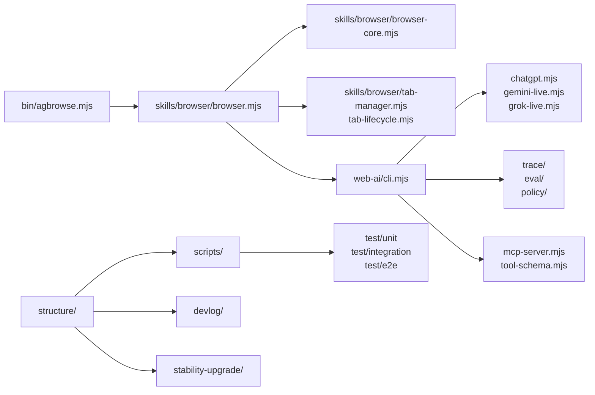

# agbrowse Architecture Source of Truth

`structure/`는 `agbrowse`의 현재 모습을 한 곳에서 읽게 해 주는 구조 허브다. `README.md`는 사용자 설치와 빠른 사용법을 설명하고, `devlog/`는 단계별 계획과 의사결정을 보존한다. 이 폴더는 그 사이에서 실제 코드 표면, 명령어, 검증 게이트, 릴리즈 주장 범위를 연결한다.

이 폴더가 중요한 이유는 `agbrowse`가 단순 CLI가 아니라 브라우저 자동화, provider web-AI, MCP bridge, eval harness, trace evidence를 함께 가진 런타임이기 때문이다. 기능을 추가할 때 코드만 바뀌면 나중에 어떤 표면이 ready인지, 어떤 표면이 beta인지, 어떤 테스트가 그 주장을 뒷받침하는지 흐려진다. `structure/`는 그 흐림을 줄이는 장치다.

사용법은 단순하다. 새 명령어, web-ai 기능, MCP tool, release gate, provider 지원 범위가 바뀌면 먼저 관련 구조 문서를 갱신한다. 그 다음 `bash structure/check-doc-drift.sh`를 실행해서 문서가 최소한의 실제 표면과 어긋나지 않는지 확인한다. 큰 변경이면 `devlog/00_index.md`와 해당 phase 문서도 함께 갱신한다.

---

## 문서 맵

| 문서 | 범위 | 같이 봐야 하는 파일 |
| --- | --- | --- |
| [str_func.md](str_func.md) | 파일 트리, 주요 모듈, line count 기준 구조 스냅샷 | `web-ai/`, `skills/browser/`, `test/` |
| [commands.md](commands.md) | `agbrowse` root CLI와 `web-ai` command surface | `skills/browser/browser.mjs`, `web-ai/cli.mjs` |
| [runtime_contracts.md](runtime_contracts.md) | sessions, tabs, provider, policy, trace, MCP, eval runtime 계약 | `web-ai/`, `skills/browser/`, `devlog/_fin/mvp/04_eval_trace/13_phase12_trace_replay.md` 이후 |
| [release_gates.md](release_gates.md) | ready/beta/experimental 라벨과 release 전 검증 | `package.json`, `scripts/release.sh`, `.github/workflows/release.yml` |
| [stability-upgrade/00_index.md](stability-upgrade/00_index.md) | 실제 작동 취약점과 안정성 upgrade backlog | live smoke, provider DOM drift, session recovery, model evidence |
| [CAPABILITY_TRUTH_TABLE.md](CAPABILITY_TRUTH_TABLE.md) | Phase 22 capability/cli-jaw mirror truth table (single source of truth) | `web-ai/`, `cli-jaw/structure/CAPABILITY_TRUTH_TABLE.md` |
| [phase_status.md](phase_status.md) | Phase 11+ 구현/미러/claim 상태 truth table | `devlog/00_index.md`, `web-ai/`, `cli-jaw` mirror |
| [check-doc-drift.sh](check-doc-drift.sh) | 구조 문서의 최소 drift 검사 | `package.json`, `README.md`, `structure/*.md` |
| [verify-counts.sh](verify-counts.sh) | `str_func.md`의 파일 수/라인 수 스냅샷 검증 | `structure/str_func.md`, live source tree |
| [AGENTS.md](AGENTS.md) | 이 폴더의 유지 규칙 | 루트 `AGENTS.md` |

Related release docs:

- [docs/production-readiness.md](../docs/production-readiness.md)
- [docs/comparison.md](../docs/comparison.md)
- [docs/benchmarks.md](../docs/benchmarks.md)
- [docs/dev/index.html](../docs/dev/index.html)
- [docs/dev/ko/index.html](../docs/dev/ko/index.html)

## 읽기 순서

1. [INDEX.md](INDEX.md)로 문서 역할을 잡는다.
2. [str_func.md](str_func.md)로 런타임 구조를 확인한다.
3. [commands.md](commands.md)로 사용자-facing command surface를 확인한다.
4. [runtime_contracts.md](runtime_contracts.md)로 runtime contract와 fail-closed 경계를 확인한다.
5. [phase_status.md](phase_status.md)로 어떤 phase가 ready/partial/deferred인지 확인한다.
6. [release_gates.md](release_gates.md)로 어떤 주장이 검증됐는지 확인한다.
7. [stability-upgrade/00_index.md](stability-upgrade/00_index.md)로 실제 작동 취약점 backlog를 확인한다.
8. `devlog/00_index.md`에서 장기 phase 계획과 mirror 요구를 확인한다.

## 시스템 맵

## 동기화 체크리스트

- [ ] `skills/browser/browser.mjs`의 command help 또는 parser가 바뀌면 [commands.md](commands.md)를 갱신한다.
- [ ] `agbrowse runway` selector/status/preflight/poll 계약이 바뀌면 [commands.md](commands.md), [runtime_contracts.md](runtime_contracts.md), `skills/browser/SKILL.md`를 같이 갱신한다.
- [ ] `web-ai/cli.mjs`의 command, provider flag, session behavior가 바뀌면 [commands.md](commands.md)와 [str_func.md](str_func.md)를 갱신한다.
- [ ] MCP tool schema가 바뀌면 [str_func.md](str_func.md)와 [release_gates.md](release_gates.md)를 갱신한다.
- [ ] live smoke, provider DOM drift, session recovery, model evidence 같은 실제 작동 취약점이 발견되면 [stability-upgrade/](stability-upgrade/00_index.md)에 상태와 검증 방법을 남긴다.
- [ ] release script, workflow, package `files` 목록이 바뀌면 [release_gates.md](release_gates.md)를 갱신한다.
- [ ] public support label이 바뀌면 `README.md`, [phase_status.md](phase_status.md), [release_gates.md](release_gates.md), 관련 `devlog/` phase 문서를 같이 갱신한다.
- [ ] benchmark 또는 comparison claim이 바뀌면 `docs/benchmarks.md`, `docs/comparison.md`, `docs/production-readiness.md`를 같이 갱신한다.
- [ ] GitHub Pages developer docs가 바뀌면 `docs/dev/`, `docs/dev/ko/`, `.github/workflows/pages.yml`, README의 Pages 링크를 같이 갱신한다.

## QA

| 명령 | 목적 |
| --- | --- |
| `bash structure/check-doc-drift.sh` | 구조 문서, package export, README 링크 최소 일치성 검사 |
| `bash structure/verify-counts.sh` | `str_func.md`의 파일 수/라인 수 스냅샷 검증 |
| `npm run test:unit` | 순수 모듈 단위 검증 |
| `npm run test:integration` | CLI, MCP, policy, provider fixture integration 검증 |
| `npm run test:eval` | provider DOM churn fixture/eval 검증 |
| `npm test` | 전체 Vitest suite |

## 변경 기록

- 2026-05-27: Runway poll 진행률/queue gate 계약을 `commands.md`, `runtime_contracts.md`, `skills/browser/SKILL.md`와 동기화했다.
- 2026-05-14: Oracle follow-up 이후 실제 작동 취약점만 추적하는 [stability-upgrade/](stability-upgrade/00_index.md) 폴더를 source-of-truth에 추가했다.
- 2026-05-06: strict-migration P02–P51 + Phase 22 머지 이후 `str_func.md` 스냅샷, `commands.md` root command 표(`new-tab`, `tab-close`), `release_gates.md`의 `gate:*` named release gate 표를 동기화했다. capability/claim 진실은 [CAPABILITY_TRUTH_TABLE.md](CAPABILITY_TRUTH_TABLE.md)에 모았다.
- 2026-05-05: Phase 11+ claim status를 [phase_status.md](phase_status.md)에 분리해 partial/deferred phase가 완료로 오해되지 않게 했다.
- 2026-05-05: `cli-jaw/structure` 패턴을 `agbrowse`에 맞게 축소하지 않고 drift/count 검증 스크립트까지 포함한 source-of-truth 허브로 추가했다.
